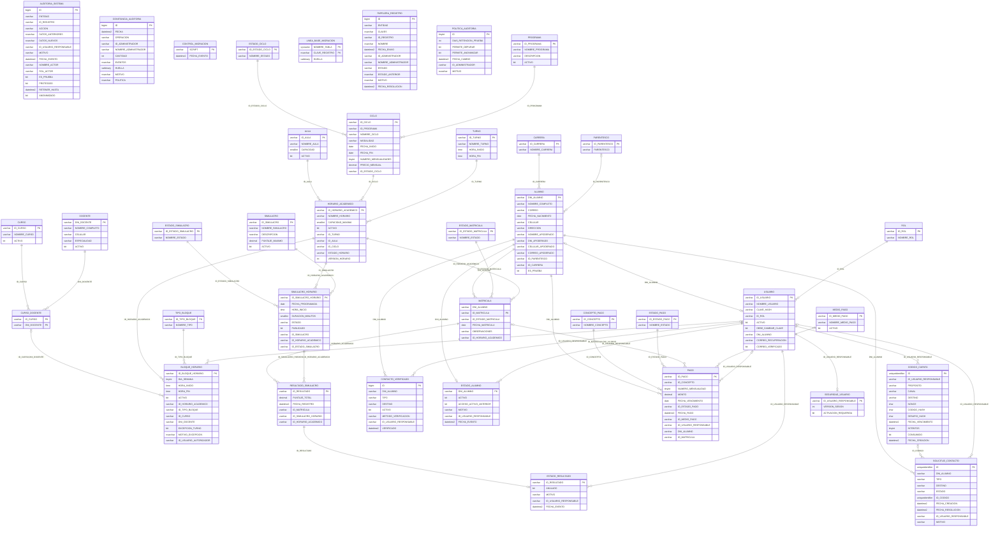

# Modelo relacional V4.5

38 tablas y 40 FK. Las referencias históricas de auditoría/papelera/constancias se documentan en el diccionario y no son FK.

```mermaid
erDiagram
    ALUMNO {
        varchar DNI_ALUMNO PK
        varchar NOMBRE_COMPLETO
        varchar CORREO
        date FECHA_NACIMIENTO
        varchar CELULAR
        varchar DIRECCION
        varchar NOMBRE_APODERADO
        varchar DNI_APODERADO
        varchar CELULAR_APODERADO
        varchar CORREO_APODERADO
        varchar ID_PARENTESCO
        varchar ID_CARRERA
        bit ES_PRUEBA
    }
    AUDITORIA_SISTEMA {
        bigint ID PK
        varchar ENTIDAD
        varchar ID_REGISTRO
        varchar ACCION
        nvarchar DATOS_ANTERIORES
        nvarchar DATOS_NUEVOS
        varchar ID_USUARIO_RESPONSABLE
        varchar MOTIVO
        datetime2 FECHA_EVENTO
        varchar NOMBRE_ACTOR
        varchar ROL_ACTOR
        bit ES_PRUEBA
        bit PROTEGIDO
        datetime2 RETENER_HASTA
        bit ANONIMIZADO
    }
    AULA {
        varchar ID_AULA PK
        varchar NOMBRE_AULA
        smallint CAPACIDAD
        bit ACTIVO
    }
    BLOQUE_HORARIO {
        varchar ID_BLOQUE_HORARIO PK
        tinyint DIA_SEMANA
        time HORA_INICIO
        time HORA_FIN
        bit ACTIVO
        varchar ID_HORARIO_ACADEMICO
        varchar ID_TIPO_BLOQUE
        varchar ID_CURSO
        varchar DNI_DOCENTE
        bit EXCEPCION_TURNO
        nvarchar MOTIVO_EXCEPCION
        varchar ID_USUARIO_AUTORIZADOR
    }
    CARRERA {
        varchar ID_CARRERA PK
        varchar NOMBRE_CARRERA
    }
    CICLO {
        varchar ID_CICLO PK
        varchar ID_PROGRAMA
        varchar NOMBRE_CICLO
        varchar MODALIDAD
        date FECHA_INICIO
        date FECHA_FIN
        tinyint NUMERO_MENSUALIDADES
        decimal PRECIO_MENSUAL
        varchar ID_ESTADO_CICLO
    }
    CODIGO_CUENTA {
        uniqueidentifier ID PK
        varchar ID_USUARIO_RESPONSABLE
        varchar PROPOSITO
        varchar CANAL
        varchar DESTINO
        char NONCE
        char CODIGO_HASH
        char DESAFIO_HASH
        datetime2 FECHA_VENCIMIENTO
        tinyint INTENTOS
        bit CONSUMIDO
        datetime2 FECHA_CREACION
    }
    CONCEPTO_PAGO {
        varchar ID_CONCEPTO PK
        varchar NOMBRE_CONCEPTO
    }
    CONSTANCIA_AUDITORIA {
        bigint ID PK
        datetime2 FECHA
        varchar OPERACION
        varchar ID_ADMINISTRADOR
        varchar NOMBRE_ADMINISTRADOR
        int CANTIDAD
        nvarchar EVENTOS
        varbinary HUELLA
        nvarchar MOTIVO
        nvarchar POLITICA
    }
    CONTACTO_VERIFICADO {
        bigint ID PK
        varchar DNI_ALUMNO
        varchar TIPO
        varchar DESTINO
        bit ACTIVO
        varchar METODO_VERIFICACION
        varchar ID_USUARIO_RESPONSABLE
        datetime2 VERIFICADO
    }
    CONTROL_MIGRACION {
        varchar SCRIPT PK
        datetime2 FECHA_EVENTO
    }
    CURSO {
        varchar ID_CURSO PK
        varchar NOMBRE_CURSO
        bit ACTIVO
    }
    CURSO_DOCENTE {
        varchar ID_CURSO PK
        varchar DNI_DOCENTE PK
    }
    DOCENTE {
        varchar DNI_DOCENTE PK
        varchar NOMBRE_COMPLETO
        varchar CELULAR
        varchar ESPECIALIDAD
        bit ACTIVO
    }
    ESTADO_ALUMNO {
        varchar DNI_ALUMNO PK
        bit ACTIVO
        bit ACCESO_ACTIVO_ANTERIOR
        varchar MOTIVO
        varchar ID_USUARIO_RESPONSABLE
        datetime2 FECHA_EVENTO
    }
    ESTADO_CICLO {
        varchar ID_ESTADO_CICLO PK
        varchar NOMBRE_ESTADO
    }
    ESTADO_MATRICULA {
        varchar ID_ESTADO_MATRICULA PK
        varchar NOMBRE_ESTADO
    }
    ESTADO_PAGO {
        varchar ID_ESTADO_PAGO PK
        varchar NOMBRE_ESTADO
    }
    ESTADO_RESULTADO {
        varchar ID_RESULTADO PK
        bit ANULADO
        varchar MOTIVO
        varchar ID_USUARIO_RESPONSABLE
        datetime2 FECHA_EVENTO
    }
    ESTADO_SIMULACRO {
        varchar ID_ESTADO_SIMULACRO PK
        varchar NOMBRE_ESTADO
    }
    HORARIO_ACADEMICO {
        varchar ID_HORARIO_ACADEMICO PK
        varchar NOMBRE_HORARIO
        smallint CAPACIDAD_MAXIMA
        bit ACTIVO
        varchar ID_TURNO
        varchar ID_AULA
        varchar ID_CICLO
        varchar ESTADO_HORARIO
        int VERSION_HORARIO
    }
    LINEA_BASE_MIGRACION {
        sysname NOMBRE_TABLA PK
        nvarchar CLAVE_REGISTRO PK
        varbinary HUELLA
    }
    MATRICULA {
        varchar DNI_ALUMNO
        varchar ID_MATRICULA PK
        varchar ID_ESTADO_MATRICULA
        date FECHA_MATRICULA
        varchar OBSERVACIONES
        varchar ID_HORARIO_ACADEMICO
    }
    MEDIO_PAGO {
        varchar ID_MEDIO_PAGO PK
        varchar NOMBRE_MEDIO_PAGO
        bit ACTIVO
    }
    PAGO {
        varchar ID_PAGO PK
        varchar ID_CONCEPTO
        tinyint NUMERO_MENSUALIDAD
        decimal MONTO
        date FECHA_VENCIMIENTO
        varchar ID_ESTADO_PAGO
        datetime2 FECHA_PAGO
        varchar ID_MEDIO_PAGO
        varchar ID_USUARIO_RESPONSABLE
        varchar DNI_ALUMNO
        varchar ID_MATRICULA
    }
    PAPELERA_REGISTRO {
        bigint ID PK
        varchar ENTIDAD
        nvarchar CLAVES
        varchar ID_REGISTRO
        nvarchar NOMBRE
        datetime2 FECHA_ENVIO
        varchar ID_ADMINISTRADOR
        varchar NOMBRE_ADMINISTRADOR
        varchar ESTADO
        nvarchar ESTADO_ANTERIOR
        nvarchar MOTIVO
        datetime2 FECHA_RESOLUCION
    }
    PARENTESCO {
        varchar ID_PARENTESCO PK
        varchar PARENTESCO
    }
    POLITICA_AUDITORIA {
        tinyint ID PK
        int DIAS_RETENCION_PRUEBA
        bit PERMITE_DEPURAR
        bit PERMITE_ANONIMIZAR
        datetime2 FECHA_CAMBIO
        varchar ID_ADMINISTRADOR
        nvarchar MOTIVO
    }
    PROGRAMA {
        varchar ID_PROGRAMA PK
        varchar NOMBRE_PROGRAMA
        varchar DESCRIPCION
        bit ACTIVO
    }
    RESULTADO_SIMULACRO {
        varchar ID_RESULTADO PK
        decimal PUNTAJE_TOTAL
        datetime2 FECHA_REGISTRO
        varchar ID_MATRICULA
        varchar ID_SIMULACRO_HORARIO
        varchar ID_HORARIO_ACADEMICO
    }
    ROL {
        varchar ID_ROL PK
        varchar NOMBRE_ROL
    }
    SEGURIDAD_USUARIO {
        varchar ID_USUARIO_RESPONSABLE PK
        int VERSION_SESION
        bit ACTIVACION_REQUERIDA
    }
    SIMULACRO {
        varchar ID_SIMULACRO PK
        nvarchar NOMBRE_SIMULACRO
        nvarchar DESCRIPCION
        decimal PUNTAJE_MAXIMO
        bit ACTIVO
    }
    SIMULACRO_HORARIO {
        varchar ID_SIMULACRO_HORARIO PK
        date FECHA_PROGRAMADA
        time HORA_INICIO
        smallint DURACION_MINUTOS
        varchar ESTADO
        bit PUBLICADO
        varchar ID_SIMULACRO
        varchar ID_HORARIO_ACADEMICO
        varchar ID_ESTADO_SIMULACRO
    }
    SOLICITUD_CONTACTO {
        uniqueidentifier ID PK
        varchar DNI_ALUMNO
        varchar TIPO
        varchar DESTINO
        varchar ESTADO
        uniqueidentifier ID_CODIGO
        datetime2 FECHA_CREACION
        datetime2 FECHA_RESOLUCION
        varchar ID_USUARIO_RESPONSABLE
        varchar MOTIVO
    }
    TIPO_BLOQUE {
        varchar ID_TIPO_BLOQUE PK
        varchar NOMBRE_TIPO
    }
    TURNO {
        varchar ID_TURNO PK
        varchar NOMBRE_TURNO
        time HORA_INICIO
        time HORA_FIN
    }
    USUARIO {
        varchar ID_USUARIO PK
        varchar NOMBRE_USUARIO
        varchar CLAVE_HASH
        varchar ID_ROL
        bit ACTIVO
        bit DEBE_CAMBIAR_CLAVE
        varchar DNI_ALUMNO
        varchar CORREO_RECUPERACION
        bit CORREO_VERIFICADO
    }
    ALUMNO ||--o{ CONTACTO_VERIFICADO : "DNI_ALUMNO"
    ALUMNO ||--o| ESTADO_ALUMNO : "DNI_ALUMNO"
    ALUMNO ||--o{ MATRICULA : "DNI_ALUMNO"
    ALUMNO ||--o{ PAGO : "DNI_ALUMNO"
    ALUMNO ||--o{ SOLICITUD_CONTACTO : "DNI_ALUMNO"
    ALUMNO |o--o| USUARIO : "DNI_ALUMNO"
    AULA ||--o{ HORARIO_ACADEMICO : "ID_AULA"
    CARRERA ||--o{ ALUMNO : "ID_CARRERA"
    CICLO ||--o{ HORARIO_ACADEMICO : "ID_CICLO"
    CODIGO_CUENTA |o--o{ SOLICITUD_CONTACTO : "ID_CODIGO"
    CONCEPTO_PAGO ||--o{ PAGO : "ID_CONCEPTO"
    CURSO ||--o{ CURSO_DOCENTE : "ID_CURSO"
    CURSO_DOCENTE |o--o{ BLOQUE_HORARIO : "ID_CURSO,DNI_DOCENTE"
    DOCENTE ||--o{ CURSO_DOCENTE : "DNI_DOCENTE"
    ESTADO_CICLO ||--o{ CICLO : "ID_ESTADO_CICLO"
    ESTADO_MATRICULA ||--o{ MATRICULA : "ID_ESTADO_MATRICULA"
    ESTADO_PAGO ||--o{ PAGO : "ID_ESTADO_PAGO"
    ESTADO_SIMULACRO ||--o{ SIMULACRO_HORARIO : "ID_ESTADO_SIMULACRO"
    HORARIO_ACADEMICO ||--o{ BLOQUE_HORARIO : "ID_HORARIO_ACADEMICO"
    HORARIO_ACADEMICO ||--o{ MATRICULA : "ID_HORARIO_ACADEMICO"
    HORARIO_ACADEMICO ||--o{ SIMULACRO_HORARIO : "ID_HORARIO_ACADEMICO"
    MATRICULA |o--o{ PAGO : "ID_MATRICULA,DNI_ALUMNO"
    MATRICULA ||--o{ RESULTADO_SIMULACRO : "ID_MATRICULA,ID_HORARIO_ACADEMICO"
    MEDIO_PAGO |o--o{ PAGO : "ID_MEDIO_PAGO"
    PARENTESCO |o--o{ ALUMNO : "ID_PARENTESCO"
    PROGRAMA ||--o{ CICLO : "ID_PROGRAMA"
    RESULTADO_SIMULACRO ||--o| ESTADO_RESULTADO : "ID_RESULTADO"
    ROL ||--o{ USUARIO : "ID_ROL"
    SIMULACRO ||--o{ SIMULACRO_HORARIO : "ID_SIMULACRO"
    SIMULACRO_HORARIO ||--o{ RESULTADO_SIMULACRO : "ID_SIMULACRO_HORARIO,ID_HORARIO_ACADEMICO"
    TIPO_BLOQUE ||--o{ BLOQUE_HORARIO : "ID_TIPO_BLOQUE"
    TURNO ||--o{ HORARIO_ACADEMICO : "ID_TURNO"
    USUARIO |o--o{ BLOQUE_HORARIO : "ID_USUARIO_AUTORIZADOR"
    USUARIO ||--o{ CODIGO_CUENTA : "ID_USUARIO_RESPONSABLE"
    USUARIO ||--o{ CONTACTO_VERIFICADO : "ID_USUARIO_RESPONSABLE"
    USUARIO ||--o{ ESTADO_ALUMNO : "ID_USUARIO_RESPONSABLE"
    USUARIO ||--o{ ESTADO_RESULTADO : "ID_USUARIO_RESPONSABLE"
    USUARIO |o--o{ PAGO : "ID_USUARIO_RESPONSABLE"
    USUARIO ||--o| SEGURIDAD_USUARIO : "ID_USUARIO_RESPONSABLE"
    USUARIO |o--o{ SOLICITUD_CONTACTO : "ID_USUARIO_RESPONSABLE"
```
